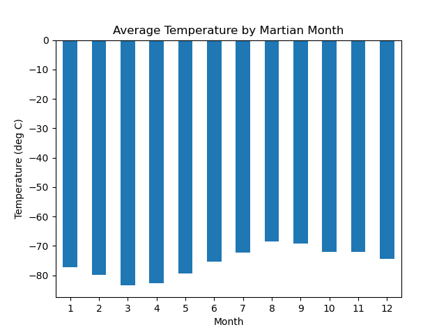
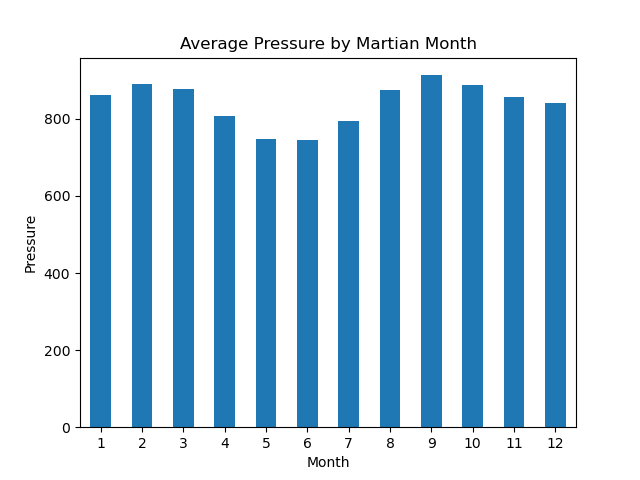
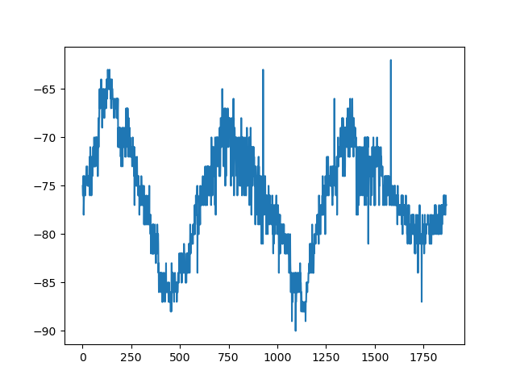
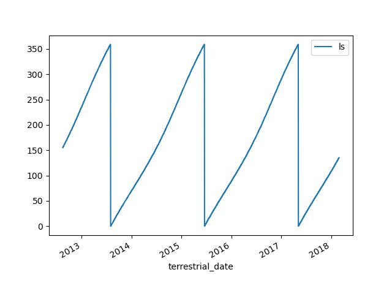

## Web_scrapping_challenge
#### This assignment consists of two technical products. 
* Scrape titles and preview text from Mars news articles.
* Scrape and analyze Mars weather data, which exists in a table.
  
## Part 1: Scrape Titles and Preview Text from Mars News
The code was worked in a Jupyter Notebook with a Beautiful Soup object to extract text elements from the website, MARS Planet Science. The article titles and preview text were extracted and stored in a Python data structure.
* Each title and preview pair was stored in a Python dictionary with two keys; <I>title, preview</I> 
* The dictionaries were stored in a Python list.
* The list was printed in the notebook. 
* The scraped data was exported to a JSON file.
 
-----
## Part 2: Scrape and Analyze Mars Weather Data
#### A new jupyter notebook was opened to run code to scrape and analyze Mars weather data. 
* Using automated browsing the website Mars Temperature was opened and inspected to identify element to scrape. 
* A Beautiful Soup object was created to scrape the data in the HTML table. 
* The data was put into a Pandas DataFrame, with the column headings the same as the headings as the table on the website.
* The data types were cast to appropriate data types to use for analysis.

#### The data was analyzed to answer the following questions:
* The number of months on Mars.
* The number of Martian days worth of data in the dataset. 
* The coldest and warmest months on Mars.
    * The information was plotted to a bar chart.
    
* The average Pressure by month on Mars.
    * The information was plotted to a bar chart.
    
* How many terrestrial (Earth) days exist in a Martian year.
    * The estimate was plotted to the daily minimum temperature.
    
    
* The DataFrame was exported to a CSV File. 

